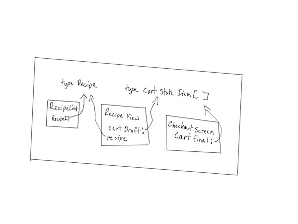

## To Run

If your environment is set up with Expo and React Native, starting this app is just `npm`|`yarn` `start`|`ios`|`android` after doing an `npm install`|`yarn`

## To Read

The app starts in `js/app/app`. All files are only 1 level deep.

## Tech Stack Used

- [x] React Native with Expo (although in a real app, may not used Expo due to issues with custom native module development).
- [x] TypeScript with all React components, Redux Actions, Redux Reducers strongly typed, meaning most errors are caught by the compiler.
- [x] `react-navigation` for native navigation capabilities, including native access to back buttons.
- [x] Redux with React Hooks to show centralized state management with the syntactic simplicity of hooks.
- [x] Native Base component library to focus on app development that works cross platform.
- [ ] Ideally would have GraphQL endpoint for data management.
- [ ] Have jest + `@testing-library/native` installed, but ran out of time to write tests.
- [ ] Have `detox` installed for E2E tests, but ran out of time to write e2e tests.
- [ ] Have Storybook to show individual components.
- [ ] Add CICD process, probably with Windows App Center.
- [ ] Add production logging, probably with Windows App Center.
- [ ] Add more Parallax Animations since it's a consumer product.
- [ ] Add i18n support.

## Architecture Principles

This application attempts to follow the following principles:

- **Flat folder structure with long names**: Following the guidance of React core dev [Dan Ambramov](https://twitter.com/dan_abramov/status/1145354949871767552).
- **Business Oriented Folders, Technically Oriented Files**: The folder structure co-locates data/ui logic in the same folder, because in real world development such files are codeveloped. However, they are still separated by file name sub extensions, thus keeping natural sepration of concerns. In a full project, filetypes would include `.reducer`, `.view`, `.queries`, `.spec`, `.constants`, `.stories`, etc.
- **Modules First**: Try to keep projects and client tech stacks small. This way, everything from trying new tech stacks to rebasing becomes easier.
- **Use Hooks and Functions**: Almost this entire app is written with functional components and hooks.
- **Use Generic UI Components When Piping Business Logic**: Screen modules, where UI meets other side effects like GraphQL, should only contain UI components that are generic by nature, thus making it easier to update the design system later.
- **Separate Complex React Components**: By keeping complex components with complex props out simpler components, we can have a longer shelf life.
- **Interface Focused Abstractions**: Try to design around minimally leaky abstractions. This way, it is easier to change internals later. This is also known as Onion Architecture.
- **Unify Modules With Basic Domain Knowledge**: Ideally, would have a `domain` package that contains general business logic. As such, it is imported by most modules within this code base. It would have types and graphql definitions. But it can also be expanded to include brand styles and functional reducers for interacting with different data structures.

## Additional Packages In A Potential Full Stack Architecture

- **domain**: Core business logic (including GraphQL types and TS types). Can be imported by both server and client code.
- **cloud-gateway**: Server endpoint. Currently has REST and GraphQL endpoints. Later could be abstracted to microservices.
- **cloud-repository**: Database. Possibly relational for related data, and document for quick read data.
- **react-component-library**: Reusable React-Native component library.

## Initial State Draft

